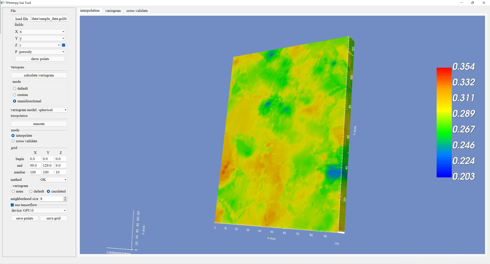

## TFInterpy
TFInterpy is a Python package for spatial interpolation. A high-performance version of several interpolation algorithms is implemented based on TensorFlow. Including parallelizable IDW and Kriging algorithms.

## Link to our paper
[TFInterpy: A high-performance spatial interpolation Python package](https://www.sciencedirect.com/science/article/pii/S2352711022001479)
 
(https://doi.org/10.1016/j.softx.2022.101229)

### Performance comparison (unit: second)

| Grid size | GeostatsPy-OK | PyKrige-OK | TFInterpy-OK | TFInterpy-TFOK(GPU) | TFInterpy-TFOK(CPU) |
| :-----: | :-----: | :-----: | :-----: | :-----: | :-----: |
| 1x104 | 23.977 | 1.258 | 0.828 | 2.070 | 0.979 |
| 1x105 | 230.299 | 12.264 | 8.140 | 6.239 | 2.067 |
| 1x106 | 2011.351 | 121.711 | 82.397 | 45.737 | 11.683 |
| 1x107 | 2784.843 | 1250.980 | 849.974 | 452.567 | 112.331 |

### Screenshots
Snapshot of GUI tool.

## Requirements
    Notice! You may do not need to install all dependencies. TFInterpy is available on pip. 
-----
#### Minimum usage requirements：  
Python 3+, Numpy, SciPy  
#### TensorFlow based algorithm:  
TensorFlow 2, Keras  
#### GSLIB file support:  
Pandas  
#### 3D visualization:  
VTK  
#### GUI Tool:  
PyQT5

